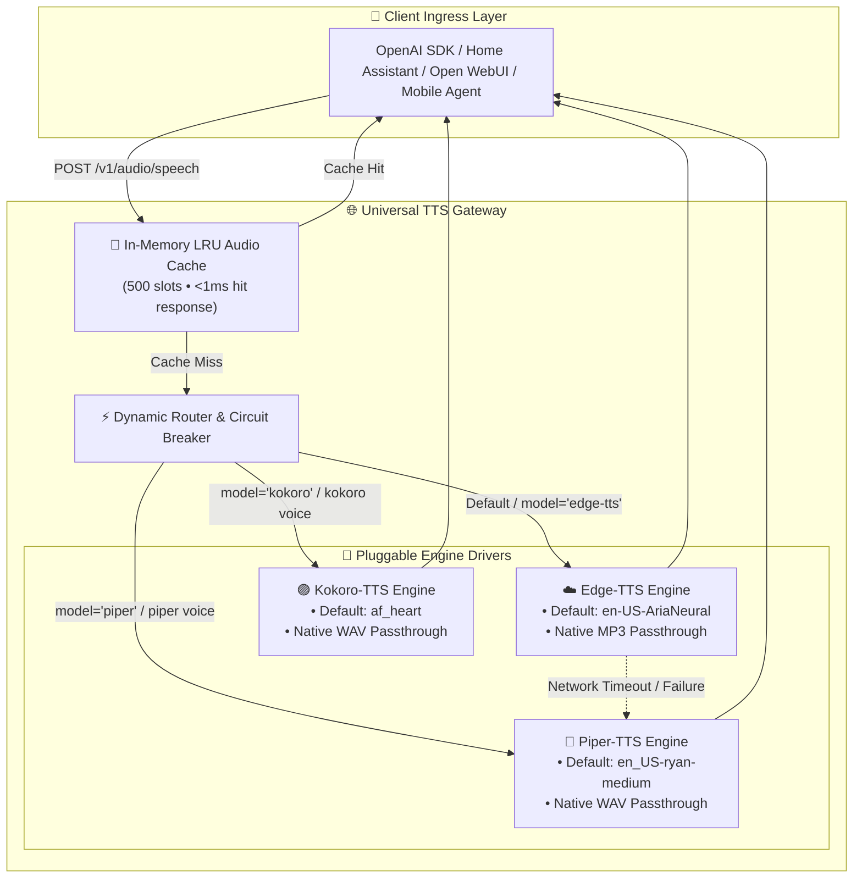

# 🌐 Universal TTS Gateway

A production-grade, multi-architecture, OpenAI-compatible Text-to-Speech (TTS) Gateway that acts as a 1:1 drop-in replacement for OpenAI's `POST /v1/audio/speech`, `GET /v1/models`, and `GET /v1/audio/voices`.

---

## ⚡ Key Highlights & Features

- **1:1 OpenAI API Compatibility:** Works with the official OpenAI SDK, Home Assistant, Open WebUI, and any client using the OpenAI speech endpoint.
- **Multi-Engine Pluggable Architecture:**
  - ☁️ **Edge-TTS (Default):** Cloud neural synthesis with `en-US-AriaNeural`. Ultra-fast response (~200–300ms), 0% local CPU load.
  - 🔵 **Piper-TTS:** Ultra-fast local edge ONNX engine with `en_US-ryan-medium` (`ryan`). 100% offline generation (~250ms).
  - 🟣 **Kokoro-TTS:** High-fidelity local ONNX engine with `af_heart`. Studio-quality prosody.
- **Zero-Transcode Fast Passthrough:** 
  - Native **MP3** passthrough for Edge-TTS (sub-250ms, zero transcoding overhead).
  - Native **WAV (PCM)** passthrough for Piper and Kokoro (zero CPU re-encoding overhead).
  - Dynamic on-the-fly transcoding if the caller explicitly requests `response_format` (`mp3`, `opus`, `aac`, `flac`, `wav`, `pcm`).
- **In-Memory LRU Audio Cache:** SHA-256 keyed cache (500 entries, ~50MB RAM limit) delivering **< 1ms response times** for repeated smart home and assistant phrases.
- **Cloud-to-Local Circuit Breaker:** Automatic fallback from Edge-TTS to local Piper-TTS (`en_US-ryan-medium`) upon network failures or timeouts.
- **Multi-Architecture Docker:** Built for `linux/amd64` (x86_64) and `linux/arm64` (Apple Silicon, Raspberry Pi 5, ARM servers).

---

## 🏛️ System Architecture



---

## 🎙️ Default Voice Matrix & Alias Mappings

| Engine | Default Voice | Fallback Behavior | Native Format | Measured Latency | Purpose |
| :--- | :--- | :--- | :---: | :---: | :--- |
| **Edge-TTS** *(Default)* | **`en-US-AriaNeural`** | If invalid voice $\to$ `en-US-AriaNeural`<br>If network fails $\to$ Piper `ryan` | Native MP3 | ⚡ **~200–300ms** | Ultra-fast, zero CPU load, studio naturalness |
| **Piper-TTS** | **`en_US-ryan-medium`** (`ryan`) | If invalid voice $\to$ `en_US-ryan-medium` | Native WAV | ⚡ **~240ms** | 100% offline, edge generation |
| **Kokoro-TTS** | **`af_heart`** | If invalid voice $\to$ `af_heart` | Native WAV | 🟣 **~2.0s** | Expressive, deep prosody |

### OpenAI Voice Alias Mapping
Standard OpenAI voice names map to natural voices:
- `alloy` $\to$ `en-US-AriaNeural`
- `echo` $\to$ `en-US-GuyNeural`
- `fable` $\to$ `en-GB-SoniaNeural`
- `onyx` $\to$ `en-US-ChristopherNeural`
- `nova` $\to$ `en-US-JennyNeural`
- `shimmer` $\to$ `en-US-AnaNeural`

---

## 🚀 Quick Start

### 1. Run with Docker Compose (Recommended)

```bash
git clone https://github.com/binuengoor/universal-tts.git
cd universal-tts

# Download default offline models (optional, for Piper & Kokoro)
python3 scripts/download_models.py

# Start gateway
docker compose up -d
```

### 2. Run Locally with `uv` / Python 3.10+

```bash
# Setup virtualenv and install dependencies
uv venv
source .venv/bin/activate
uv pip install -e ".[all]"

# Download offline models (Piper + Kokoro)
python scripts/download_models.py

# Start server
uvicorn gateway.main:app --host 0.0.0.0 --port 8000
```

---

## 💻 API Usage Examples

### Using OpenAI Python SDK

```python
from openai import OpenAI

client = OpenAI(
    base_url="http://localhost:8000/v1",
    api_key="not-needed",  # or set your configured TTS_SERVER__API_KEY
)

response = client.audio.speech.create(
    model="edge-tts",  # or 'piper', 'kokoro', 'tts-1'
    voice="alloy",     # mapped to en-US-AriaNeural
    input="Universal TTS Gateway is ready for production!",
)

response.stream_to_file("output.mp3")
```

### Using cURL

```bash
# Edge-TTS (Native MP3)
curl http://localhost:8000/v1/audio/speech \
  -H "Content-Type: application/json" \
  -d '{
    "model": "edge-tts",
    "voice": "en-US-AriaNeural",
    "input": "Hello from Universal TTS Gateway!"
  }' \
  --output speech.mp3

# Piper Offline (Native WAV)
curl http://localhost:8000/v1/audio/speech \
  -H "Content-Type: application/json" \
  -d '{
    "model": "piper",
    "voice": "ryan",
    "input": "Offline voice synthesis running at the edge."
  }' \
  --output speech.wav

# Kokoro Studio Voice
curl http://localhost:8000/v1/audio/speech \
  -H "Content-Type: application/json" \
  -d '{
    "model": "kokoro",
    "voice": "af_heart",
    "input": "High fidelity text to speech with expressive prosody."
  }' \
  --output speech.wav
```

### Inspect Available Voices & Models

```bash
# List OpenAI-compatible models
curl http://localhost:8000/v1/models

# List all available voices across all engines
curl http://localhost:8000/v1/audio/voices

# Gateway & Engine Health Status
curl http://localhost:8000/health
```

---

## ⚙️ Configuration Reference (`config.yaml`)

Configuration can be set via `config.yaml` or environment variables (prefixed with `TTS_`):

```yaml
server:
  host: "0.0.0.0"
  port: 8000
  api_key: ""                      # Optional Bearer token authentication
  cors_origins: ["*"]

defaults:
  engine: "edge-tts"
  voice: "en-US-AriaNeural"
  speed: 1.0
  response_format: "mp3"

cache:
  enabled: true
  max_entries: 500                 # Maximum cached audio snippets
  max_memory_mb: 50                # Memory budget for audio cache
  ttl_seconds: 86400               # 24h TTL

circuit_breaker:
  enabled: true
  timeout_seconds: 5.0
  fallback_engine: "piper"
  fallback_voice: "en_US-ryan-medium"
```

---

## 🧪 Benchmark & Testing

Run the automated test and benchmark suite:

```bash
pytest -v -s
```

Sample Benchmark Output:
```text
================================================================================
ENGINE       | VOICE              | LATENCY (ms)   | CACHE  | SIZE (KB)  | RTF
--------------------------------------------------------------------------------
edge-tts     | en-US-AriaNeural   | 285.12         | MISS   | 45.84      | 0.0
edge-tts     | en-US-AriaNeural   | 0.66           | HIT    | 45.84      | 0.0
piper        | en_US-ryan-medium  | 247.37         | MISS   | 265.04     | 0.0402
kokoro       | af_heart           | 2036.59        | MISS   | 353.04     | 0.2704
================================================================================
```

---

## 📄 License

MIT License. See [LICENSE](LICENSE) for details.
